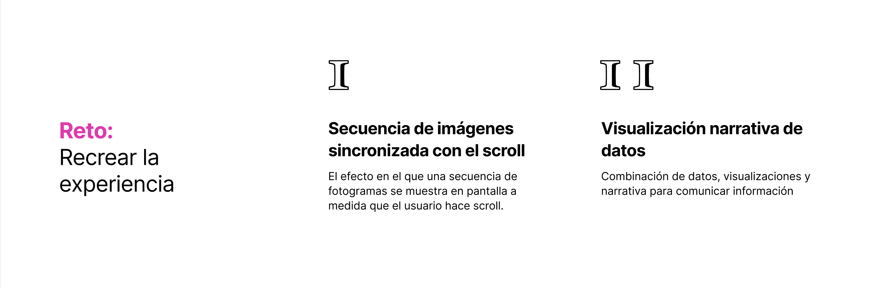

# web-scrarping-climaterealism

Este repositorio permite extraer imágenes de un archivo HTML, guardarlas localmente y utilizarlas en una animación controlada por el desplazamiento de la página. El archivo index.html define la estructura de la web y muestra la animación, cargando las imágenes desde un archivo JSON. Selection.html contiene una lista de imágenes cuyas URLs son extraídas por un script en Python. Main.py procesa este archivo, descarga las imágenes y almacena sus rutas en image_urls.json, que luego es utilizado por index.html para mostrar la animación. La biblioteca imagesloaded.pkgd.min.js asegura que todas las imágenes estén cargadas antes de iniciar la animación. El archivo README.md describe el proyecto, mientras que la carpeta downloaded_images almacena los archivos descargados. El flujo de trabajo integra Python y JavaScript para automatizar la extracción, almacenamiento y visualización de imágenes en una animación dinámica basada en el desplazamiento.

main.py extrae las URLs de selection.html, descarga las imágenes y guarda las rutas en image_urls.json.
index.html carga estas URLs, pre-carga las imágenes y actualiza la animación en función del desplazamiento del usuario.

## Inspiración 

Este proyecto se inspira en la WWF Climate Realism Exhibition, que combina arte, tecnología y ciencia para crear una experiencia interactiva que sensibiliza sobre el cambio climático a través de una narrativa visual envolvente.

